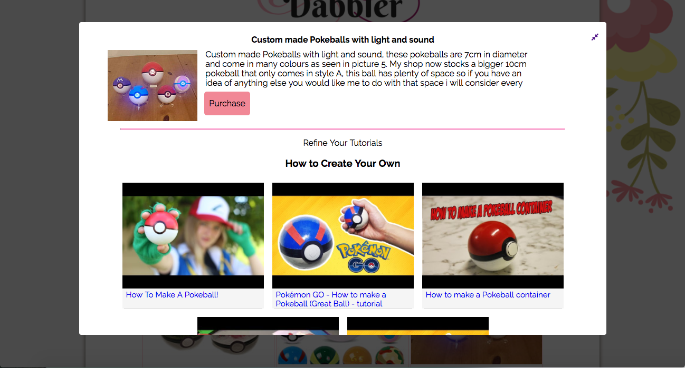

# Dabbler

Dabbler is an online search tool that retrieves a list of hand-made crafts and provides matching video tutorials on how to create the items. 

# Usage

Upon submitting a search word, this site utilizes Etsy's API to return the search results, which are displayed on a responsive 12-item grid.

A user can view additional details by clicking on a search result item. This opens up a modal window containing a description of the item, a purchase button for the Etsy store listing, and a list of 5 Youtube tutorials for the result item.

# Technology

- This site uses HTML and CSS to present its contents in an attractive and responsive theme appealing to its constituents. 
- This site also utilizes JavaScript and jQuery to retrieve data from both Etsy's and YouTube's APIs via AJAX. 